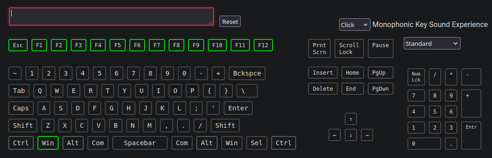

# GMK67-Config
My configurations and start up program for Fn row on Linux

## Fn Row in Linux (Tested in Ubuntu 24.XX)
- [linux-fn-row-fix](./linux-fn-row-fix/) : Running the [autostart.sh](./linux-fn-row-fix/autostartup.sh) copies a Bash file ([gmk67fnrow.sh](./linux-fn-row-fix/assets/gmk67fnrow.sh)) to ```/opt/``` and make it execute at system bootup using systemd.

#### To enable Fn Row of GMK67 on Ubuntu:
1. Clone the repository
   ```git clone https://github.com/ShamalLakshan/GMK67-Config.git```

2. Run linux-fn-row-fix as sudo 
   ```cd GMK67-Config/linux-fn-row-fix && sudo ./autostartup.sh```

3. It will automatically setup everything!
4. It is better to reboot the system after this operation to check whether the script is working. (Not essential, It should work fine after running the script.)

#### Running the script
[](https://asciinema.org/a/cKdvhNqtxuG2XgehlSON0hLCZ)

#### Test


---

## Custom Knob Mapping in Ubuntu
#### Knob Commands
Knob Click = ```['AudioMute']```
Knob Rotate Left = ```['AudioLowerVolume']```
Knob Rotate Right = ```['AudioRaiseVolume']```


#### Shortcuts to map
Play / Pause = ```['AudioMute']``` | Knob Click 
Volume Down = ```['AudioLowerVolume']``` | Knob Rotate Left
Volume Up = ```['AudioRaiseVolume']``` | Knob Rotate Right
Previous Track = ```['<Super>AudioLowerVolume']``` | Super(Win) + Knob Rotate Left
Next Track = ```['<Super>AudioRaiseVolume']``` | Super(Win) + Knob Rotate Right
Media Player = ```['<Super>AudioMute']``` | Super(Win) + Knob Click

#### Notice
>  - A reboot is required after setting the custom map for it to work properly!!!
>
> - Shortcut resetting script too included.

#### Setting Custom Knob Map on Ubuntu 
[](https://asciinema.org/a/6Ezy2esDnJFjn9SHBtKewWdI8)