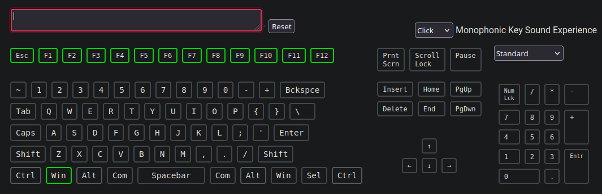

## Fn Row in Linux (Tested in Ubuntu 24.XX)
- [linux-fn-row-fix](./linux-fn-row-fix/) : Running the [autostart.sh](./linux-fn-row-fix/autostartup.sh) copies a Bash file ([gmk67fnrow.sh](./linux-fn-row-fix/assets/gmk67fnrow.sh)) to ```/opt/``` and make it execute at system bootup using systemd.

### To enable Fn Row of GMK67 on Ubuntu:V
1. Clone the repository
   ```git clone https://github.com/ShamalLakshan/GMK67-Config.git```

2. Run linux-fn-row-fix as sudo 
   ```cd GMK67-Config/linux-fn-row-fix && sudo ./autostartup.sh```

3. It will automatically setup everything!
4. It is better to reboot the system after this operation to check whether the script is working. (Not essential, It should work fine after running the script.)

## Running the script
[](https://asciinema.org/a/cKdvhNqtxuG2XgehlSON0hLCZ)


## Test

